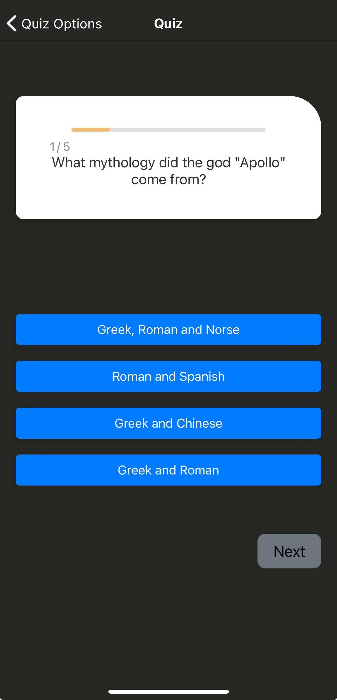
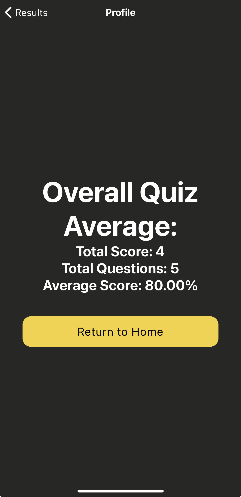

<a id='readme-top'> </a>

<h1 align="center"> TriviaTrove </h1>


<details>
 <summary>Table of Contents</summary>

1. [Project Overview](https://github.com/wtucker29/TriviaTrove?tab=readme-ov-file#project-overview)
2. [Getting Started](https://github.com/wtucker29/TriviaTrove?tab=readme-ov-file#getting-started)
   - [Prerequsites](https://github.com/wtucker29/TriviaTrove?tab=readme-ov-file#prerequisites)
   - [Installation](https://github.com/wtucker29/TriviaTrove?tab=readme-ov-file#installation)
3. [Roadmap](https://github.com/wtucker29/TriviaTrove?tab=readme-ov-file#roadmap)
4. [Usage](https://github.com/wtucker29/TriviaTrove?tab=readme-ov-file#usage)
5. [Team Members](https://github.com/wtucker29/TriviaTrove?tab=readme-ov-file#team-members)
   
</details>


## Project Overview

<div align="center">
  <h3>Splash Page</h3>
  
<br />
    <h3>Home Page</h3>
  
<br />
    <h3>Question Count, Topic, Difficulty, and Question Type Selection</h3>
  
<br />
    <h3>Questions Display</h3>
  
  
<br />
    <h3>Results Page</h3>
  
<br />
    <h3>Profile Page</h3>
  
</div>

<br />

<p>
TriviaTrove is a mobile version of my desktop QuizWhiz application. The idea of TriviaTrove is to have a way to practice for your local trivia night, or to just have fun and learn new things!
</p>
<ul>
<li><b>The Splash Page</b>: This is the welcome page to the application.</li>
<li><b>The Home Page</b>: The Home Page gives users the option to go to the quiz selection page, or the profile page to look at their statistics.</li>
<li><b>Question Count, Topic, Difficulty, and Question Type Selection</b>: This screen allows the user to select the question count, topic, difficulty, and question type for their trivia. If a topic, difficulty, or question type is not selected, the API will randomize the response back to the user.</li>
<li><b>Questions Display</b>: The main screen when answering trivia questions has a bar above the question, indicating the user's current progress through the selected quiz. The possible answers are displayed in blue, and change to green or red on user selection, indicating a correct or incorrect answer.</li>
<li><b>Results Page</b>: This page displays the user's score, before directing them to the Profile page to see their overall average.</li>
<li><b>Profile Page</b>: This page displays the user's overall quiz average, along with the number of correct answers and total questions.</li>
</ul>

### Built With


[](https://reactnative.dev/)


## Getting Started
<p>
    Instructions to setup TriviaTrove on your local machine below.
</p>

### Prerequisites 


[](https://expo.dev/)

```sh
npm install npm@latest -g
```

### Installation 

1. Clone the repo
```sh
git clone https://github.com/wtucker29/TriviaTrove
```

2. Install dependencies using
```sh
npm install 
```
3. Run in your dev environment: 
```
npm run start
``` 
4. Scan the QR code to open TriviaTrove in the ExpoGo application, or use the other options provided by Expo

 <p align="right">(<a href="#readme-top">back to top</a>)</p>

## Roadmap 

- [x] Develop a mobile trivia application
- [x] Implement a quiz page with a progress bar, and animations
- [x] Implement a Profile page that displays the quiz average based on the user's result.
- [ ] Utilize local storage to store user results in the Profile page.

 <p align="right">(<a href="#readme-top">back to top</a>)</p>
 
## Usage

TriviaTrove is run using Expo. Scan the QR code when running the npm start script.

 <p align="right">(<a href="#readme-top">back to top</a>)</p>

## Team Members

<h3 align='center'>William Tucker</h3>
<h4 align='center'>
  <a href="https://linkedin.com/in/william-tucker-9b628462">Linkedin</a> |
  <a href="https://github.com/wtucker29">GitHub</a>
</h4>

 <p align="right">(<a href="#readme-top">back to top</a>)</p>
